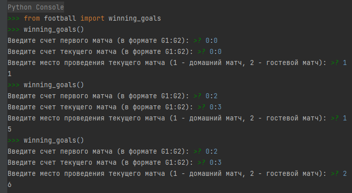
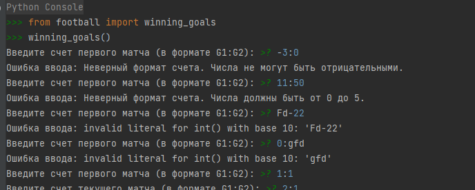

## Описание реализации задачи 0
В файле `football.py` реализована функция, которая помогает комментатору сделать вывод о том, сколько нужно забить 
мячей, чтобы выиграть игру, не доводя её до дополнительного времени и (или) серии пенальти, учитывая текущий матч 
(гостевой\домашний).

Функция `winning_goals` оборачивается декоратором `input_validator` для валидации вводимых данных.

Декоратор `input_validator` валидирует данные и выводит сообщение об ошибке, а также предотвращает остановку выполнения
функции, если данные были переданы некорректно.

Валидация включает в себя:
- Формат счета;
- Проверка на отрицательные числа;
- Числа не должны превышать 5.

Для тестирования функции импортируйте её из файла и просто вызовите `winning_goals()` и далее следуйте инструкциям.

Вы должны увидеть что-то типа этого:

## Описание проекта (реализация задачи 1)

Реализовывается АПИ сервис по регистрации клиентов и записи на прием в ветеринарную клинику через ТГ-бота. Основные функции, которые включает в себя:
- Регистрация клиентов с сохранением в БД имени, фамилии, телефона и телеграмм чат id;
- Запись на прием для зарегистрированных клиентов с сохранением в БД даты и времени записи, видом животного;
- Админ панель для менеджеров с возможность просмотра, поиска и фильтрации клиентов клиники и записей на прием.

Дополнительные функции, которые будут заложены в реализацию:
- Автотестирование функционала для проверки отказоустойчивости системы;
- Swagger;
- Автогенерация документации к АПИ;
- Менеджеры по заполнению БД.

Настоящая инструкция будет предусматривать развертывание проекта в локальном сегменте и через docker

Для работы проекта потребуются:

- Python
- Django
- Postgresql
- DRF

