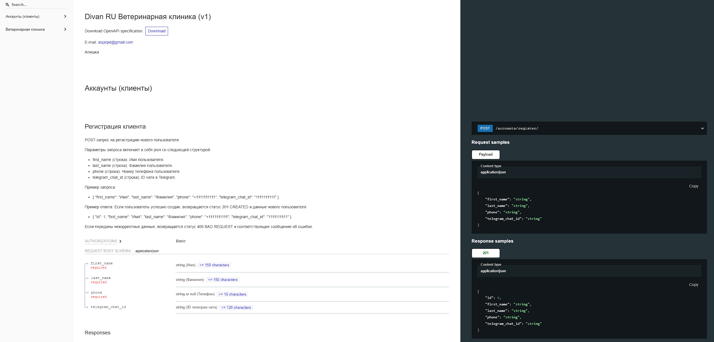

# Описание реализации задачи 0
В файле `football.py` реализована функция, которая помогает комментатору сделать вывод о том, сколько нужно забить 
мячей, чтобы выиграть игру, не доводя её до дополнительного времени и (или) серии пенальти, учитывая текущий матч 
(гостевой\домашний).

Функция `winning_goals` оборачивается декоратором `input_validator` для валидации вводимых данных.

Декоратор `input_validator` валидирует данные и выводит сообщение об ошибке, а также предотвращает остановку выполнения
функции, если данные были переданы некорректно.

Валидация включает в себя:
- Формат счета;
- Проверка на отрицательные числа;
- Числа не должны превышать 5.

Для тестирования функции импортируйте её из файла и просто вызовите `winning_goals()` и далее следуйте инструкциям.

Вы должны увидеть что-то типа этого:


# Описание проекта (реализация задачи 1)

Реализован АПИ сервис по регистрации клиентов и записи на прием в ветеринарную клинику через ТГ-бота. 
Основные функции, которые включает в себя:
- Регистрация клиентов с сохранением в БД имени, фамилии, телефона и телеграмм чат id;
- Запись на прием для зарегистрированных клиентов с сохранением в БД даты и времени записи, видом животного;
- Админ панель для менеджеров с возможность просмотра, поиска и фильтрации клиентов клиники и записей на прием.

Дополнительные функции, которые заложены в реализацию:
- Автотестирование функционала для проверки отказоустойчивости системы;
- Swagger;
- Автогенерация документации к АПИ;
- Менеджеры по заполнению БД.

Настоящая инструкция предусматривает развертывание проекта в локальном сегменте и через docker

### API-сервис
После успешного запуска проекта всю документацию к API Вы найдете по адресу: http://127.0.0.1:8000/redoc/

Взаимодействовать с API-сервисом можно через swagger: http://127.0.0.1:8000/swagger/

Ввесь набор интрументов, опций, пояснений изложены в `swagger`.

API-сервис выполняет следующие функции:
- Регистрация клиента
- Получение клиента по ID
- Получение списка типов животных
- Получение списка свободных слотов для записи на приём в ветеринарную клинику
- Запись на приём клиента со своим животным

Из соображений, что клиника тратит на приём по 30 минут, то решил автоматизировать ротацию календаря со временем, 
учитывая:
- Рабочее время клиники с 09:00 - 18:00 без перерыва и выходных
- Шаг времени, затрачиваемое на приём 30 минут

Воспользуйтеьс автотестами для приложений `accounts` и `vetclinics`. Все тесты расположены в поддерикториях tests.
- Тестируется регистрация клиента через фабрику
- Тестируется запись на прием через фабрику
- Тестируется получение свободных слотов


Представляю несколько скриншотов интерфейсов API:




### Панель администратора

Панель администратора удовлетворяет всем требованиям, которые изложены в задании (поиск, фильтрация, 
дружелюбный интерактив)

Доступ к админ-панели: http://127.0.0.1:8000/admin

Не забудьте создать суперпользователя, когда рзвернетесь локально или через докер (инструкция будет ниже)
```
python manage.py createsuperuser
```


Для работы проекта потребуются:

- Python
- Django
- Postgresql
- DRF

# Запуск проекта локально

1. Клонировать проект:
    ```
    git clone https://github.com/EchoFoe/divanru_vetclinic.git
    ```
2. Создайте виртуальное окружение в корне проекта (зависит от вашей ОС) и установите зависимости
    ```
    pip install -r requirements.txt
    ```
3. Создайте БД (postgres), отредактируйте файл `.env` (использует python-dotenv) в корне проекта и укажите свои конфиги
    ```
    DB_NAME=your_db_name
    DB_USER=your_db_user
    DB_PASSWORD=your_db_pass
    DB_HOST=localhost
    DB_PORT=5432
    SECRET_KEY=your_django_secret_key
    TELEGRAM_BOT_TOKEN=token
    BASE_API_URL=http://127.0.0.1:8000
   ```
4. Создайте суперпользователя:
    ```
    python manage.py createsuperuser 
    ```
5. Произведите миграции:
    ```
    python manage.py migrate 
    ```
6. Заполните БД данными с помощью менеджера:
    ```
    python manage.py populate_animal_types 
    ```
Вы увидите что-то типа этого:


7. Запустить сервер разработки:
    ```
    python manage.py runserver 
    ```
8. Запустить телеграм-бота:
    ```
    python tg_bot.py 
    ```
9. Обратись к телеграм-боту `https://t.me/divanru_vetclinic_bot`
- Пройдите регистрацию
- Запишитесь на приём к ветеринару


# Запуск проекта через Docker

1. Клонировать проект:
    ```
    git clone https://github.com/EchoFoe/divanru_vetclinic.git
    ```
2. Отредактируйте файл `.env` (использует python-dotenv) в корне проекта и укажите свои конфиги
    ```
    DB_NAME=your_db_name
    DB_USER=your_db_user
    DB_PASSWORD=your_db_pass
    DB_HOST=localhost
    DB_PORT=5432
    SECRET_KEY=your_django_secret_key
    TELEGRAM_BOT_TOKEN=token
    BASE_API_URL=http://127.0.0.1:8000
   ```
3. Поднять Dockerfile:
    ```
    docker-compose up 
    ```
4. Заполните БД данными с помощью менеджера:
    ```
    python manage.py populate_animal_types 
    ```
5. Запустить телеграм-бота:
    ```
    python tg_bot.py 
    ```
